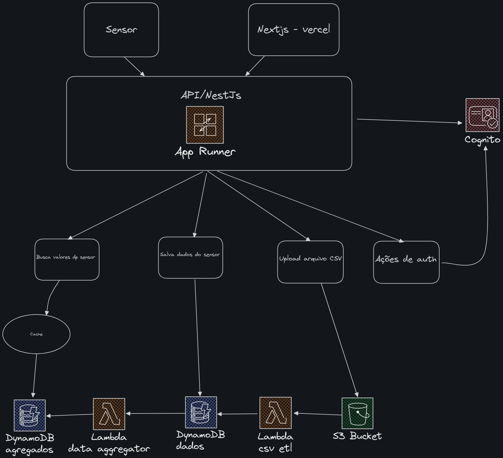
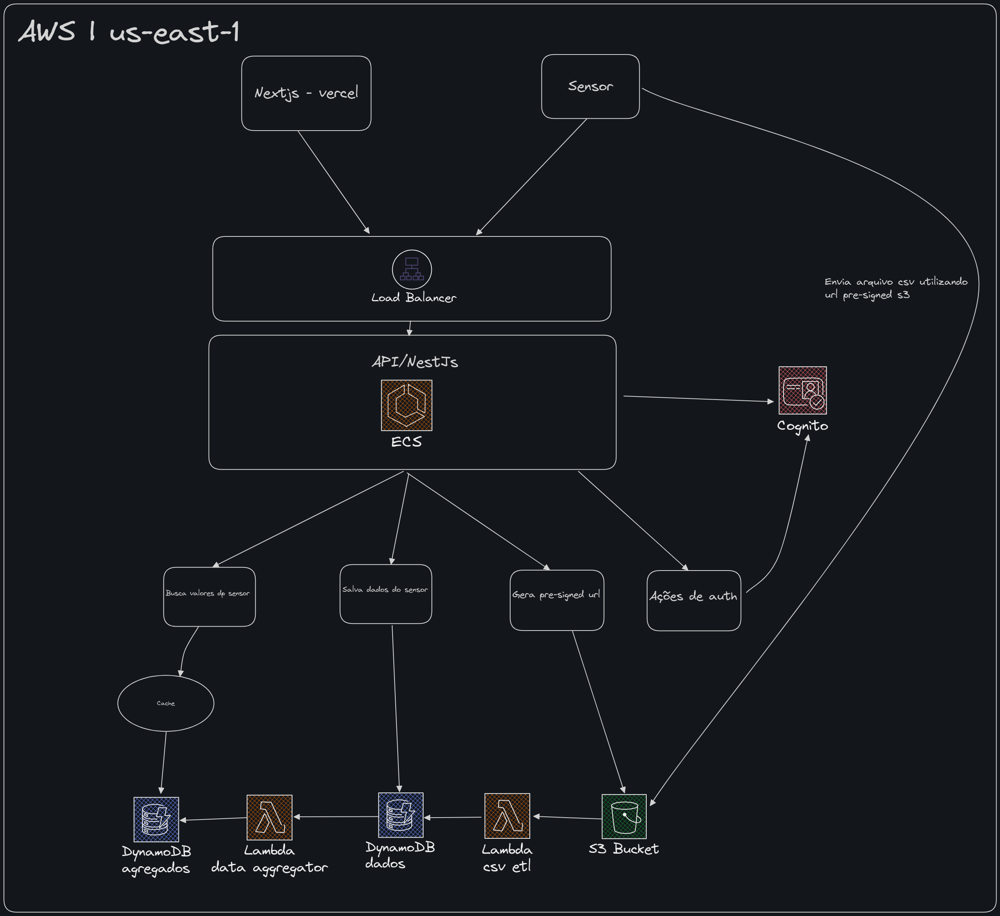

# **Sumário**

1. [Sensor Flow API](#sensor-flow-api)  
2. [Como Acessar a Aplicação](#como-acessar-a-aplicação)  
   - [Credenciais de Acesso](#credenciais-de-acesso)  
   - [O que você pode fazer na aplicação](#o-que-você-pode-fazer-na-aplicação)  
3. [System Design Atual](#system-design-atual)  
4. [Funcionalidades Implementadas](#funcionalidades-implementadas)  
   - [Autenticação](#autenticação)  
   - [Autenticação para Máquinas](#autenticação-para-máquinas)  
   - [Registro de Sensores](#registro-de-sensores)  
   - [Listagem de Dados Agregados](#listagem-de-dados-agregados)  
   - [Processamento de Arquivos com Lambda](#processamento-de-arquivos-com-lambda)  
   - [Popular Dados Agregados](#popular-dados-agregados)  
5. [Estrutura Modular](#estrutura-modular)  
6. [Tecnologias Utilizadas](#tecnologias-utilizadas)  
7. [Infraestrutura e CI/CD](#infraestrutura-e-cicd)  
   - [Infraestrutura com AWS SAM](#infraestrutura-com-aws-sam)  
   - [Pipelines de Build com AWS CodeBuild](#pipelines-de-build-com-aws-codebuild)  
   - [Arquivos buildspec](#arquivos-buildspec)  
8. [Como Executar o Projeto](#como-executar-o-projeto)  
9. [Testes de Integração](#testes-de-integração)  
10. [Pensado em Escala Global](#pensado-em-escala-global)  
11. [Principais Mudanças](#principais-mudanças)  
    - [ECS Fargate](#ecs-fargate)  
    - [Application Load Balancer](#application-load-balancer)  
    - [S3 Pre-Signed URL](#s3-pre-signed-url)  
    - [Deploy Multi-Regional](#deploy-multi-regional)  
12. [Testes de Carga](#testes-de-carga) 

# Sensor Flow API

**Sensor Flow API** é uma API desenvolvida para receber, processar e gerenciar registros de sensores.


## **Como Acessar a Aplicação**

A aplicação Sensor Flow está disponível na Vercel e pode ser acessada através do link abaixo:

🔗 [Sensor Flow - Frontend](https://sensor-flow-front.vercel.app)

### **Credenciais de Acesso**

Você pode utilizar um dos seguintes usuários para fazer login:

1. **Usuário:** `test-user`  
   **Senha:** `test-1234`

2. **Usuário:** `radix`  
   **Senha:** `Radix2024@`

---

### **O que você pode fazer na aplicação**
- **Visualizar dados de sensores.**
- **Consultar estatísticas e gráficos.**
- **Explorar dados agregados em diferentes intervalos de tempo.**

# System Design Atual:



## Funcionalidades Implementadas

### **Autenticação**
A API conta com um sistema de autenticação baseado em **Cognito**, com suporte a cookies HTTP-only para segurança. A autenticação atual permite:

- **Login**: Autenticação de usuários utilizando `username` e `password`.
  - Gera um token JWT com validade de 1 hora.
  - O token é armazenado em um cookie seguro `httpOnly`.

#### **Endpoints**

- **POST `/auth/login`**
  - Realiza o login utilizando credenciais no formato Basic Auth.
  - Retorna uma mensagem de sucesso e configura o cookie com o token.
  - O token JWT armazenado no cookie é validado utilizando o **Cognito JWKS URI**.

- **GET `/auth/me`**
  - Retorna as informações do usuário autenticado.
  - Requer que o usuário esteja autenticado via JWT.

- **POST `/auth/logout`**
  - Realiza o logout do usuário.
  - Remove o cookie de autenticação.

## Autenticação para máquinas

Para que máquinas ou scripts automatizados possam interagir com a API, é necessário realizar a autenticação seguindo uma lógica específica.

#### **Autenticação para Obter o Token para Máquinas**

Exemplo de autenticação para obter o token de acesso para máquinas:

```python
import requests
import random
import uuid
from datetime import datetime, timedelta

# Substitua pelos valores corretos
auth_url = ''
client_id = ''
client_secret = ''

auth_payload = {
    "grant_type": "client_credentials",
    "client_id": client_id,
    "client_secret": client_secret,
    "scope": "default-m2m-resource-server-mztddy/read"
}

auth_headers = {'Content-Type': 'application/x-www-form-urlencoded'}

response = requests.post(auth_url, data=auth_payload, headers=auth_headers)

if response.status_code == 200:
    token = response.json().get('access_token')
    print("Token obtido com sucesso!")
else:
    print(f"Erro ao obter o token: {response.status_code} {response.text}")
    exit()
```
---


### **Registro de Sensores**

#### **Endpoints**

- **POST `/sensor-data`**
  - Recebe os dados de sensores no formato JSON:
    ```json
    {
      "equipmentId": "EQ-12495",
      "timestamp": "2023-02-15T01:30:00.000-05:00",
      "value": 78.42
    }
    ```
  - Armazena os dados no **DynamoDB** com as colunas:
    - `equipmentId`
    - `timestamp`
    - `value`
    - `registerTime`

- **POST `/sensor-data/upload-csv`**
  - Recebe um arquivo CSV contendo as colunas:
    - `equipmentId`
    - `timestamp`
    - `value`
  - Armazena o arquivo CSV no **AWS S3** para processamento posterior via Lambda.

---

### **Listagem de Dados Agregados**

#### **Endpoints**

- **GET `/sensor-data/aggregated`**
  - Consulta dados agregados da tabela `aggregated` no DynamoDB.
  - Suporta filtros dinâmicos:
    - `24h`: últimas 24 horas
    - `48h`: últimas 48 horas
    - `1w`: última semana
    - `1m`: último mês
  - Parâmetros de consulta:
    - `interval`: Especifica o intervalo de tempo (`24h`, `48h`, `1w`, `1m`).

  - Exemplo de requisição:
    ```http
    GET /sensor-data/aggregated?interval=24h
    ```

  - Exemplo de resposta:
    ```json
    {
      "average": 78.42,
      "totalCount": 20,
      "items": [
        {
          "equipmentId": "EQ-12495",
          "intervalStart": 1693468800,
          "totalValue": 1500.75,
          "sampleCount": 20
        }
      ]
    }
    ```

---

### **Processamento de Arquivos com Lambda**

Uma função Lambda em Python é responsável por processar os arquivos CSV enviados para o S3. Esta função:
- Lê o arquivo CSV utilizando `pandas`.
- Insere cada linha do arquivo no DynamoDB com as colunas:
  - `equipmentId`
  - `timestamp`
  - `value`
  - `register_time`

---

### **Popular Dados Agregados**

Uma função Lambda em python é acionada via **DynamoDB Streams** para popular a tabela de agregados com base nos dados da tabela de escrita. Esta função:

1. Processa eventos do **DynamoDB Streams**.
2. Para cada evento:
   - Extrai as informações do equipamento, timestamp e valor.
   - Determina o intervalo de tempo (`intervalStart` arredondado para a hora cheia).
   - Atualiza ou cria o registro correspondente na tabela de agregados.
3. A tabela de agregados tem as seguintes colunas:
   - `partitionKey`: Valor fixo (`GLOBAL`) para consultas eficientes.
   - `equipmentId`: Identificação do equipamento.
   - `intervalStart`: Timestamp do início do intervalo.
   - `totalValue`: Soma dos valores agregados.
   - `sampleCount`: Número de amostras no intervalo.

## **Estrutura Modular**

A aplicação foi projetada com uma estrutura modular utilizando o framework **NestJS**.

#### **Módulos**

1. **Auth Module**:
   - Implementa a autenticação via Cognito.
   - Inclui estratégias JWT para validação.
   - Contém:
     - `AuthController`
     - `AuthService`
     - `JwtStrategy`

2. **SensorData Module**:
   - Gerencia o registro de dados de sensores e upload de arquivos CSV.
   - Contém:
     - `SensorDataController`
     - `SensorDataService`

3. **App Module**:
   - Ponto de entrada principal da aplicação.
   - Integra os módulos de autenticação e monitoramento de saúde.

4. **Config Module**:
   - Carrega variáveis de ambiente globais usando `@nestjs/config`.

---

## Tecnologias Utilizadas

- **Node.js**
- **NestJS**
- **AWS Cognito**
- **DynamoDB**
- **AWS S3**
- **AWS Lambda**
- **Python**

---

## Infraestrutura e CI/CD

A aplicação utiliza **AWS SAM** para definição da infraestrutura como código e **AWS CodeBuild** para pipelines de CI/CD. A seguir, detalhamos os principais arquivos de configuração utilizados.

### Infraestrutura com AWS SAM

O arquivo `template.yaml` define os recursos necessários na AWS para a aplicação **Sensor Flow**, incluindo buckets S3, tabelas DynamoDB, funções Lambda e repositórios ECR.

### Pipelines de Build com AWS CodeBuild

A pipeline de CI/CD é acionada por commits na branch main. O processo de build segue os seguintes passos:

1. **Build dos Lambdas:**
   - Utiliza o arquivo `buildspec_lambda.yml` para construir e empacotar as funções Lambda.

2. **Deploy da Infraestrutura:**
   - Utiliza o `template.yaml` para deployar recursos como Lambdas, Buckets S3, Tabelas DynamoDB e repositórios ECR.

3. **Build da API NestJS:**
   - Utiliza o arquivo `buildspec-nest.yml` para construir a aplicação NestJS.
   - A imagem resultante é enviada para o repositório ECR criado na etapa anterior.

4. **Configuração do App Runner:**
   - É necessário criar um **App Runner** e registrar a imagem do ECR.
   - O App Runner é configurado para atualizar automaticamente sempre que uma nova imagem é enviada ao repositório ECR.

### Arquivos `buildspec`

- **buildspec_lambda.yml**: Para construir e empacotar as funções Lambda.
- **buildspec-nest.yml**: Para construir e publicar a aplicação NestJS no Amazon ECR.

---

## Como Executar o Projeto

1. **Clone o repositório:**
   ```bash
   git clone https://github.com/seu-usuario/sensor-flow.git
   cd sensor-flow
   ```

2. **Instale as dependências:**
   ```bash
   npm install
   ```

3. **Configure as variáveis de ambiente no arquivo `.env`:**
   ```
   AWS_REGION=seu-regiao
   COGNITO_CLIENT_ID=seu-client-id
   COGNITO_CLIENT_SECRET=seu-client-secret
   COGNITO_AUTH_URI=seu-auth-uri
   DYNAMODB_TABLE_NAME=sensor-data-table
   DYNAMODB_AGGREGATE_TABLE_NAME=aggregated-data-table
   S3_BUCKET_NAME=sensor-data-bucket
   ```

4. **Execute a aplicação:**
   ```bash
   npm run start
   ```

---

## Testes de Integração

O projeto inclui testes de integração para garantir o funcionamento correto dos principais endpoints e funcionalidades. Para executar os testes, siga os passos abaixo:

**Execute os testes:**
   ```bash
   npm run test:e2e
   ```

### Testes de integração

- **Health module integration tests**
  - Verifica se o endpoint raiz (`/`) está funcionando corretamente, retornando `200` com a resposta esperada.

- **Auth module integration tests**
  - Testa o fluxo de autenticação:
    - Login bem-sucedido e recebimento do cookie de autenticação.
    - Falha no login com credenciais incorretas.
    - Logout e remoção do cookie de autenticação.
    - Acesso negado a rotas protegidas após logout.

- **Sensor aggregated data module integration tests**
  - Testa a recuperação de dados agregados com diferentes intervalos de tempo (`24h`, `48h`, `1w`, `1m`) e valida respostas de sucesso.
  - Verifica o retorno de erro `400` para intervalos inválidos.

- **Sensor data module integration tests**
  - Testa o registro de dados de sensores:
    - Criação bem-sucedida de dados de sensores.
    - Falha ao criar dados de sensores com payload inválido.
  - Testa o upload de arquivos CSV:
    - Upload bem-sucedido de um arquivo CSV válido.
    - Rejeição de uploads sem arquivos.
    - Rejeição de uploads com arquivos não CSV.

# Pensado em escala global:



# Principais Mudanças

## ECS Fargate
- Alteração do App Runner para ECS Fargate.
- Proporciona uma escalabilidade mais eficiente e com maior controle.
- Integrando com ALB ao ECS Fargate permite distribuir as requisições de maneira eficiente.

## Application Load Balancer
- Adição de um Application Load Balancer para distribuir o tráfego entre os containers da aplicação
- Oferece suporte a roteamento inteligente e balanceamento de carga eficiente.

## S3 Pre-Signed URL
- Alteração no método de upload de arquivos para utilizar pre-signed URLs
- Aplicação não precise lidar com o upload de arquivos, apenas com a geração de URLs para que os usuários possam fazer o upload diretamente para o S3, desafogando a aplicação

## Deploy multi-regional
- Deploy da aplicação em múltiplas regiões para melhorar disponibilidade e latência.
- Melhora a disponibilidade e a latência em diferentes regiões

## Cache com Redis
- Adição de um cache Redis para armazenar dados temporários e acelerar o acesso a dados frequentemente acessados.
- Comparado ao nestjs-cache, o Redis oferece mais flexibilidade e escalabilidade.

## **Testes de Carga**

Como executar Locust:

```bash
locust -f locust/locustfile.py
```

em seguida, acesse `http://localhost:8089` para configurar e iniciar os testes de carga.

Resultados dos testes de carga utilizando o Locust com diferentes volumes de requisições:

- [Baixar relatório: 500 requisições](locust/locust-500-users.html)
- [Baixar relatório: 1.000 requisições](locust/locust-1000-users.html)
- [Baixar relatório: 5.000 requisições](locust/locust-5000-users.html)
- [Baixar relatório: 10.000 requisições](locust/locust-10000-users.html)

Para visualizar, faça o download do arquivo e abra-o no navegador da sua máquina.
